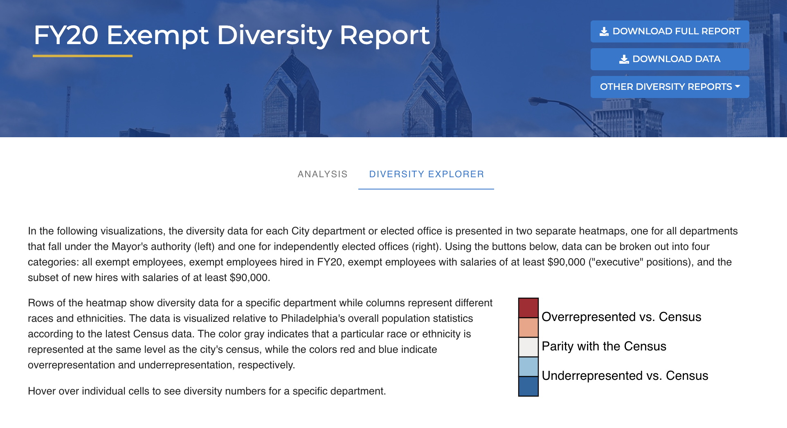
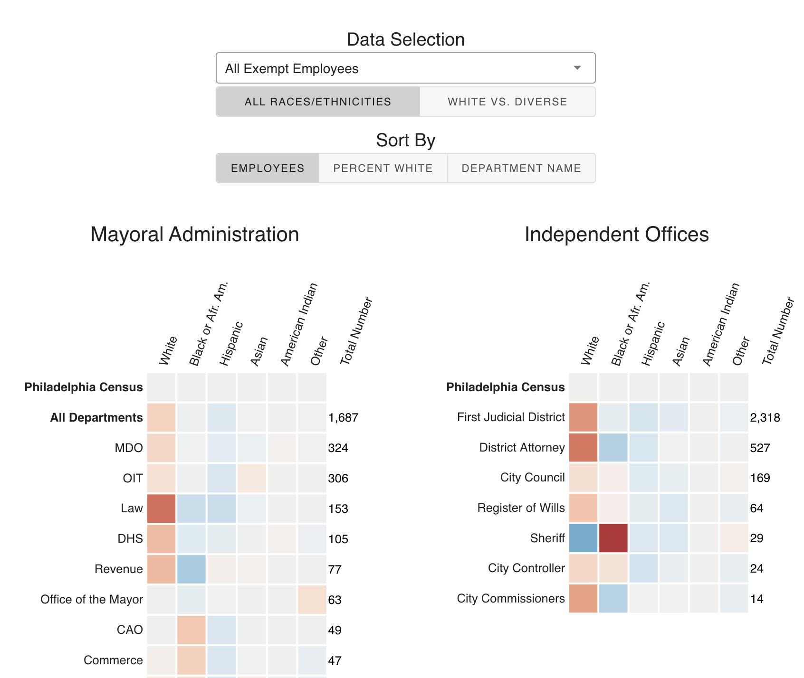
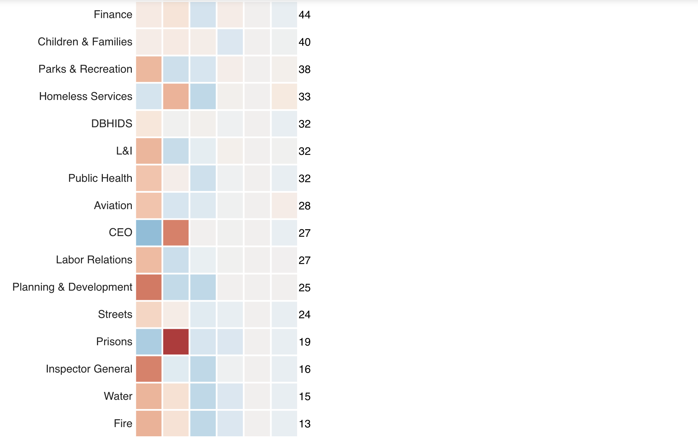
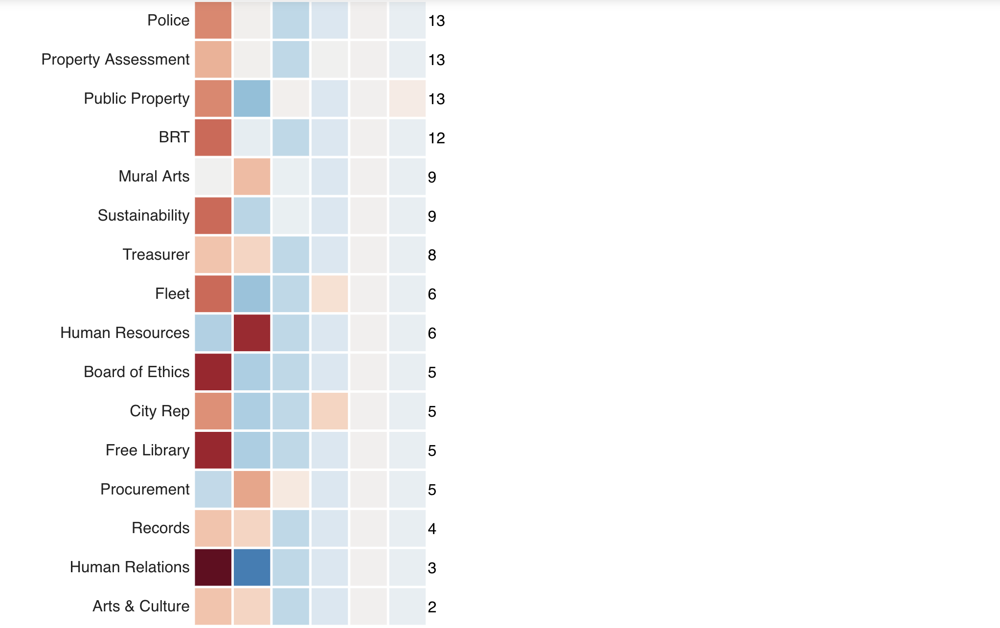

# Exempt Employee Diversity Review

The code behind the interactive review of the diversity of the City of Philadelphia's exempt workforce. The annual
reviews are available on the City Controller's website:

- [FY19](https://controller.phila.gov/philadelphia-audits/fy19-exempt-employee-diversity/)
- [FY18](https://controller.phila.gov/philadelphia-audits/fy18-exempt-employee-diversity/)







## Tools

The application is built using a combination of open-source tools, including
[vue](https://github.com/vuejs/vue), [vuetify](https://github.com/vuetifyjs/vuetify), 
and [d3](https://github.com/d3/d3).

## Development

### Project setup
```
yarn install
```
### Compiles and hot-reloads for development

```
yarn run serve
```
### Compiles and minifies for production

```
yarn run build
```
